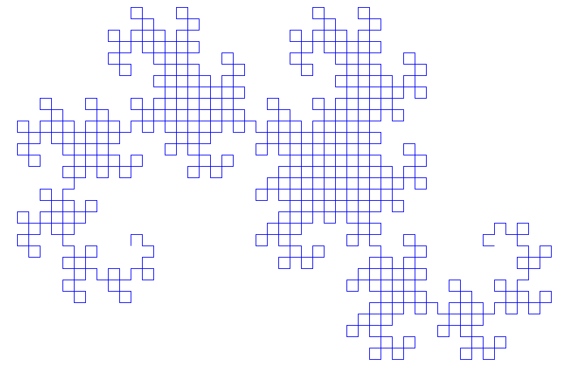

# Draconian anxiety poems

This week's assignment is creating a [poetic form](http://spinelessbooks.com/table/tableofforms.html) using [tracery](http://tracery.io).

I wanted to use this assignment as an exploration of my anxieties, of my fears, of the eternal presence of them in my life. I want to speak about how these fears get into my life, how they get under my skin unpredictably and inexorably, and how they stop me from doing things -or make everything much more complicated.

I will generate six different lines for the poem, which will be mixed according to the result of a [dragon-curve](https://en.wikipedia.org/wiki/Dragon_curve). In order to reflect the prevalence of my fears, that phrase will shape the whole stanza. All the text will be a column with the width of the selected fear. It will potentially be the only phrase that fits the column perfectly, bringing it to the spotlight. This form, is a combination of a *polyline* (using only lines from a small list) and a *homonoline* (made up term (?) where every line has the same length). It is worth noting that apart from randomly selecting the lines, the resulting poem is always going to be the same thanks to the deterministic approach taken to build it.


<br>
The 

<br>
## Anxiety as a resource
As a source for these creations, I used some fears I have to start the texts. I selected some adjectives (fear of being XX) and verbs (fear of XX).

```python
fearA = ["abandoned",
         "seen",
         "invisible",
         "unhappy",
         "exposed",
         "wrong",
         "hated",
         "resentful",
         "forgotten",
         "inadequate",
         "embarassed",
         "shamed"]
fearV = ["failing",
         "wasting opportunities",
         "letting you down",
         "looking into myself",
         "hurting someone",
         "hurting myself",
         "suffering",
         "exposing myself",
         "losing my family",
         "time passing me by",
         "nothing getting better",
         "going back"]
```

Also, I looked online for some simple verbs that my fears prevent me from doing; and based some moods on the corpora files for encouraging_words and states_of_drunkenness.


### New rules
I realized I needed a tracery modifier that didn't exist, adding "-ing" to a verb, so I created it:

```python
def ing(text, *params):
    if text[-1] == 'e':
        return text[:-1] + "ing"
    elif text[-1] in 'bgmnpt' and len(text) <= 4:
        if text[-2] in "aeiou" and text[-3] not in "aeiou":
            return text + text[-1] + "ing"
        else:
            return text + "ing"
    else:
        return text + "ing"
```


### Poem grammar
For these poems reiteration of the concepts is a must, so I looked at [Kate's tracety tutorials](http://www.crystalcodepalace.com/traceryTut.html) to know how to save a randomly chosen variable. From this starting point, I created some phrases and alternatives to each line, making the length of the stanza aleatory (following the last example of the last class).


```python
rules = {
    # rules for creating the texts
    "origin": "[#setFear#][#setAction#]#fp##hope#",
    "keep": ["\nit kept me from #action.ing#","\nkeeps me from #action.ing#"],
    "even": ["\neven when I'm feeling #g_mood#"],
    "want": "\nI do want to #action#",
    "baad": ["\nbut I'm not good, I'm not","\nyet I feel #b_mood#", "\nthough #b_mood# I am"],
    "hope": ["\nbut I can be #g_mood#","\nI know I can be #g_mood#","\nI know I can survive"],
    # phrases
    "fp": "\nmy fear of\n#fear##kp#",  #fear phrase
    "kp": ["#keep##pp#", "#keep##fp##pp#"], #keep phrase
    "pp": ["#even#", "#want#", "#even##baad#", "#want##baad#"], #possitive phrase
    # saving information
    "setFear": ["[fear:being #fear_adj#]","[fear:#fear_ver#]"],
    "setAction": "[action:#act#]",
    # lists
    "fear_adj": fearA,
    "fear_ver": fearV,
    "act": actions,
    "g_mood": mood_good,
    "b_mood": mood_baad
}
```

### Formatting the poem
Finally, I needed to create a function to turn the text into a column of a specific length and make sure the fear itself does not get wrapped. The column function was not difficult, but to make sure the fear itself is displayed correctly, I needed to prepend blank spaces to the first line ("my fear of").

```python
def columnize(text, length):
    # initialize array of new text
    column_text = []
    # we're going over the whole text
    i = 0
    while i < len(text):
        # append to the list the next chunk of text
        column_text.append( text[i:i+length] )
        # augment the index
        i += length
    return '\n'.join(column_text)

def fear_col(text):
    # first, we transform the text into a list
    text_list = text.strip().split('\n')
    # the target length is the length of the fear phrase
    length = len(text_list[1])

    # calc how many blank spaces to add to the first line
    num_spaces = (length - len(text_list[0])%length +1)%length
    if num_spaces == 0:
        pass
    else:
        # prepend
        for i in range(num_spaces -2):
            text_list[0] = ' ' + text_list[0]

    fear_text = columnize(' '.join(text_list), length)
    return fear_text
```

### First result
Following the previously stated rules, I managed to create some poems that turned out pretty good. Bellow, one example:

```
my fear of
being inadequate
it kept me from
eating my fear
of being inadequ
ate keeps me fro
m eating my fear
of being inadeq
uate keeps me fr
om eating I do w
ant to eat even
when I'm feeling
cool though pis
sed I am I do wa
nt to eat I know
I can survive
```


<br>
## Dragon curve
A dragon curve is a [L-system](https://en.wikipedia.org/wiki/L-system) that follows the following replacement rules:

- variables: `X`, `Y`
- constants: `F`, `+`, `-`
- start: `FX`
- rules:
  - `X` > `X+YF+`
  - `Y` > `-FX-Y`



The code to generate this system is the following:
```python
drg_rules = {
    "X": "X+YF+",
    "Y": "-FX-Y",
    "F": "F",
    "+": "+",
    "-": "-"
}
# variables
drg_gens = 3     # how many times it will loop
drg_sys = []     # saving the l-system generations
drg_sys.append("FX") # set the starting point

# l-system generation looping
for i in range(drg_gens):
    # create a new generation
    drg_sys.append("")
    # create the new system according to the rules
    for c in drg_sys[i]:
        drg_sys[i+1] += drg_rules[c]
```

To reinterpret this system, I'll give each of the characters a specific meaning:
- `F`: fear phrase
- `+`: "even when..."
- `-`: bad mood phrase
- `X`: what it keeps/kept me from doing
- `Y`: "I want/wish to..." phrase
- `.`: hopeful phrase

Finally, I will give these generated texts the same treatment to achieve the desired outcome.


<br>
## Generated poems
Bellow, I present three generated poems with the described algorithms.

### *hated, not shouting*
```
my fear of
being hated
 it kept me
 from shout
ing even wh
en I'm feel
ing wonderf
ul I do wan
t to shout
my fear of
being hated
 even when
I'm feeling
 wonderful
but I'm not
 good, I'm
not my fear
 of being h
ated it kep
t me from s
houting but
 I'm not go
od, I'm not
 I do want
to shout it
 kept me fr
om shouting
 even when
I'm feeling
 wonderful
I do want t
o shout my
fear of bei
ng hated ev
en when I'm
 feeling wo
nderful but
 I'm not go
od, I'm not
 my fear of
 being hate
d it kept m
e from shou
ting but I'
m not good,
 I'm not I
do want to
shout I kno
w I can sur
vive
```

### *letting you down, not traveling*
```
my fear of
letting you down
keeps me from t
raveling even wh
en I'm feeling f
antastic I do wa
nt to travel my
fear of letting
you down even wh
en I'm feeling f
antastic even wh
en I'm feeling f
antastic but I'm
not good, I'm n
ot my fear of le
tting you down k
eeps me from tra
veling but I'm n
ot good, I'm not
I do want to tr
avel my fear of
letting you down
even when I'm f
eeling fantastic
even when I'm f
eeling fantastic
but I'm not goo
d, I'm not my fe
ar of letting yo
u down keeps me
from traveling e
ven when I'm fee
ling fantastic I
do want to trav
el my fear of le
tting you down e
ven when I'm fee
ling fantastic b
ut I'm not good,
I'm not but I'm
not good, I'm n
ot my fear of le
tting you down k
eeps me from tra
veling but I'm n
ot good, I'm not
I do want to tr
avel my fear of
letting you down
even when I'm f
eeling fantastic
but I can be br
illiant
```

### *invisible, not singing*
```
my fear of
being invisible
it kept me fro
m singing even
when I'm feelin
g amazing I rea
lly wish to sin
g my fear of be
ing invisible e
ven when I'm fe
eling amazing e
ven when I'm fe
eling amazing b
ut I'm not good
, I'm not my fe
ar of being inv
isible it kept
me from singing
but I'm not go
od, I'm not I r
eally wish to s
ing my fear of
being invisible
even when I'm
feeling amazing
even when I'm
feeling amazing
but I'm not go
od, I'm not my
fear of being i
nvisible it kep
t me from singi
ng even when I'
m feeling amazi
ng I really wis
h to sing my fe
ar of being inv
isible even whe
n I'm feeling a
mazing but I'm
not good, I'm n
ot but I'm not
good, I'm not m
y fear of being
invisible it k
ept me from sin
ging but I'm no
t good, I'm not
I really wish
to sing my fear
of being invis
ible even when
I'm feeling ama
zing I know I c
an be fantastic
```
